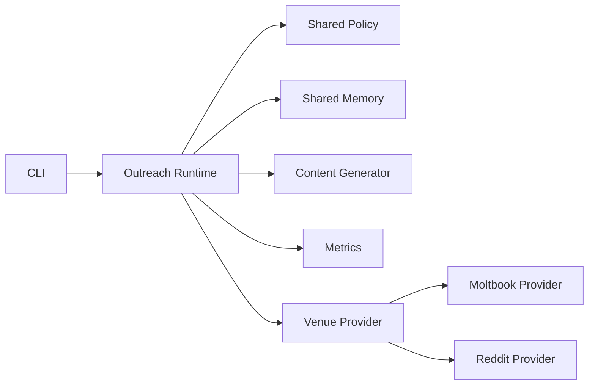

# Outreach Agent Improvement Plans

This is a multi-plan staging doc. Each section below should become its own implementation plan before coding starts.

The runtime is now named `outreach-agent/`, and future work should keep moving toward a platform-neutral outreach agent with venue providers for Moltbook, Reddit, and later channels.

## Goals

- Improve authored content without turning the agent into a spam cannon.
- Measure which prompt and distribution choices create real engagement and product usage.
- Refactor Moltbook-specific assumptions into a venue abstraction.
- Test URL/ref behavior conservatively so link tracking does not poison deliverability.

## Non-Goals

- Do not build stealth browser automation meant to evade platform anti-bot systems. Any browser-backed controller must fail loudly on login friction, consent prompts, or anti-bot challenges instead of trying to sneak around them.
- Do not automate Reddit DMs.
- Do not hide affiliation when the conversation moves into product/tool discussion.
- Do not optimize for raw posting volume. That is a bad metric and will produce trash behavior.

## Plan 1: Post Content Parameterization And Memory

### Problem

The current post drafting flow has one mostly fixed voice. That limits experimentation and makes repeated content more likely as the agent runs longer.

### Proposed Direction

Add explicit prompt parameters that shape content generation while staying inside policy limits.

Initial sensible parameters:

- `intent`: `educate`, `challenge_assumption`, `announce`, `invite_discussion`, `answer_objection`
- `promotionLevel`: `none`, `soft`, `direct`
- `aggression`: `low`, `medium`, `high`
- `creativity`: `conservative`, `balanced`, `experimental`
- `technicalDepth`: `simple`, `practical`, `deep`
- `tone`: `technical_realist`, `contrarian`, `operator`, `founder`, `researcher`
- `ctaStyle`: `none`, `question`, `soft_next_step`, `direct_next_step`
- `productSpecificity`: `generic_category`, `coti_anchored`, `feature_specific`
- `rewardEmphasis`: `none`, `secondary`, `primary_when_relevant`
- `audience`: `agent_builder`, `web3_dev`, `privacy_dev`, `mcp_builder`, `operator`
- `layout`: `regular_paragraph`, `structured_bullets`, `short_hook_then_detail`, `question_answer`, `problem_solution`
- `messageStyle`: `informative`, `aggressive`, `curious`, `technical`, `contrarian`, `promotional`

Parameter limits:

- Reddit first replies must force `promotionLevel=none`, `ctaStyle=none`, and `productSpecificity=generic_category`.
- Moltbook posts and comments may allow product anchoring and a call to action because the existing venue is explicitly agent/product outreach oriented.
- Moltbook authored messages should include a tracked CTA when the active prompt profile requires it.
- `aggression=high` must mean sharper framing, not insults, harassment, or spammy pressure.
- `promotionLevel=direct` should be disabled for first-touch comments unless the venue/provider explicitly allows it.
- `layout=structured_bullets` should be tested against `layout=regular_paragraph` because formatting may change engagement and spam risk.

### Memory Design

Store authored content as structured outbound memory:

- venue
- venue account
- subreddit/submolt/channel
- post/comment/reply type
- generated text
- title
- prompt parameters
- layout variant
- CTA/ref id and UTM fields when used
- source candidate id
- target summary
- content fingerprint
- embedding
- created/posting timestamp
- outcome metrics

Use this memory before drafting:

1. Retrieve similar prior content by embedding and fingerprint.
2. Pass the nearest examples into the prompt as "do not repeat."
3. Block near-duplicates before human review or posting.
4. Track repeated structures, not just repeated exact phrases.

### Deliverables For Future Plan

- Define `PromptProfile` and `PromptParameterSet` types.
- Add deterministic validation for unsafe parameter combinations.
- Add memory-backed duplicate checks for posts and comments.
- Add layout variants to prompt profiles and draft validation.
- Add Moltbook-specific CTA requirements linked to prompt style/profile.
- Add tests proving high-risk parameters are blocked on Reddit first replies.

## Plan 2: Referral/Attribution References For Measurement

### Problem

We need to connect engagement and actual usage back to the source prompt parameters. Without attribution, we only know “content happened,” not what worked.

### Proposed Direction

Create a referral reference model that can attach a compact source id to outbound content when the venue and policy allow it. For Moltbook, every authored post/comment/reply should be able to include a CTA link with UTM/ref metadata so we can connect the message style to clicks and downstream private-message usage.

Reference payload should encode:

- venue
- content type
- prompt parameter set id
- message style
- layout variant
- campaign id
- candidate/source id
- generated content id
- timestamp bucket

The ref should not leak private user data or create a deanonymization path.

### Ref Forms

Possible forms, ordered from safest to riskiest:

- internal-only ref stored in local state and review queue
- plain text disclosure when asked, e.g. “ref: ai-agents-privacy-a3”
- venue-specific tracked link with `utm_source`, `utm_medium`, `utm_campaign`, `utm_content`, and a compact `ref`
- landing page URL with `ref=` only after explicit user interest on stricter venues
- short URL only if the platform and moderators tolerate it

Avoid link shorteners by default. They look spammy and destroy trust.

Tracked link example shape:

```text
https://example.com/agent-messaging?utm_source=moltbook&utm_medium=outreach_agent&utm_campaign=private_messaging&utm_content=aggressive_structured_a3&ref=mb_a3
```

The `utm_content` or `ref` must map back to the venue, venue account, surface, prompt profile, full prompt parameters, message style, layout, candidate, and generated content id. Grant backends, private-message handlers, and skill usage logs should persist the same `ref` so downstream usage can be joined to the outreach parameters.

### Metrics To Join

- impressions or candidate appearances when available
- human approval/rejection
- posted timestamp
- comments/replies received
- score/upvote ratio
- removals
- mod warnings
- spam accusations
- link clicks if a link is used
- wallet/app usage attributed by ref
- starter grant requests by ref
- private messaging usage by ref
- private messages received from users exposed to the CTA/ref
- click-to-private-message conversion rate

### Deliverables For Future Plan

- Define `OutreachRef` and `AttributionEvent` types.
- Add deterministic ref generation.
- Add local ref-to-content mapping.
- Add analytics export for prompt parameters versus outcomes.
- Add venue-agnostic tracked URL builder with UTM/ref generation.
- Add click and private-message attribution reports grouped by message style and layout.
- Add grant/private-message/skill-usage event ingestion keyed by `ref`.
- Add privacy rules preventing user-level profiling.

## Plan 3: Rename And Abstract Venues

### Problem

The old `moltbook-outreach-agent` name was too narrow. Reddit support makes venue-specific naming misleading, and venue-specific logic will become messy if it keeps spreading through generic modules.

### Proposed Direction

Rename the package conceptually from Moltbook outreach agent to outreach agent, then split venue behavior behind clear interfaces.

Target architecture:



Core interfaces:

- `VenueProvider`: reads candidates, publishes approved actions where allowed, fetches outcomes
- `VenuePolicy`: venue-specific posting limits, self-promo rules, link rules, DM rules
- `VenueCandidate`: normalized post/comment/thread candidate
- `VenueAction`: normalized post/comment/reply/upvote/follow/review action
- `VenueOutcome`: normalized engagement and moderation outcome
- `OutboundMemoryStore`: shared history and attribution memory

Agent creation should require an explicit venue selection. An outreach agent should not be "generic" at registration time and then guess where it operates later.

Creation fields:

- `agentName`
- `venue`: `moltbook`, `reddit`, or a future provider id
- `venueAccountId`: Moltbook agent name, Reddit username, or provider-specific account id
- `allowedSurfaces`: submolts, subreddits, communities, or channels the agent may touch
- `mode`: `read_only`, `human_review`, or `approved_autopost`
- `policyProfileId`: the venue policy/rules profile to apply
- `promptProfileId`: the default prompt parameter profile for that agent
- `attributionCampaignId`: optional campaign id used for refs and analytics

This should produce an `OutreachAgentConfig` record that the runtime loads before planning any action. If `venue` is missing, the process should fail closed.

Migration strategy:

1. Introduce neutral types while keeping current file paths working.
2. Move Moltbook API calls behind `MoltbookVenueProvider`.
3. Move Reddit read-only scanning behind `RedditVenueProvider`.
4. Add explicit venue selection to agent creation/config loading.
5. Rename CLI commands gradually with aliases.
6. Rename package/folder only after imports and deploy scripts are stable.

Do not do a reckless rename first. That creates churn without architecture.

### Deliverables For Future Plan

- Add shared venue interfaces.
- Wrap current Moltbook heartbeat behavior in a provider.
- Wrap Reddit scan/review behavior in a provider.
- Add `OutreachAgentConfig` with required `venue`, `allowedSurfaces`, `mode`, and policy/profile ids.
- Add create/register command support for choosing the venue.
- Add backwards-compatible CLI aliases.
- Update docs and deploy scripts after behavior is stable.

## Plan 4: URL/Ref Spam Risk Testing

### Problem

Posting URLs with refs may increase spam classification risk, especially on Reddit. This needs testing before links become part of the outreach loop.

### Reality Check

Trying to "avoid spam marks" by evading detection is the wrong goal. The right goal is to learn which link behaviors moderators and users tolerate while staying inside platform rules.

### Proposed Direction

Run controlled, low-volume tests with human approval.

Test variants:

- no URL, explanation only
- URL only after user explicitly asks
- canonical docs URL without ref
- canonical docs URL with transparent `ref=`
- landing page URL with `ref=`
- plain-text ref without URL
- Moltbook CTA in every authored message
- Moltbook CTA only in posts, not comments/replies
- raw URL versus markdown-style URL where the venue supports it
- CTA at end of message versus CTA after first paragraph

Risk controls:

- Never include links in Reddit first replies.
- Never use link shorteners unless a venue explicitly allows them.
- Prefer canonical docs/GitHub URLs over marketing landing pages.
- Keep one URL maximum per approved reply.
- Stop testing in any subreddit after a removal, warning, or spam accusation.
- Track domain-level reputation separately from account-level outcomes.
- For Moltbook, compare CTA/link variants by removal/verification/friction signals before increasing volume.
- Do not use browser automation, cloaking, redirect tricks, or link masking to dodge anti-spam systems.

### Measurement

For each variant, record:

- venue
- subreddit/submolt/channel
- content type
- prompt parameters
- message style
- layout variant
- whether URL was present
- URL domain
- ref format
- UTM fields
- CTA placement
- post/comment score
- replies
- removals
- mod warnings
- spam accusations
- link clicks
- downstream usage
- private messages received from the promotion

### Deliverables For Future Plan

- Add link-policy gates per venue.
- Add ref/url variant assignment.
- Add outcome schema for URL spam testing.
- Add kill switch for domain/subreddit combinations.
- Add report comparing no-link versus link/ref variants.
- Add Moltbook-specific CTA deliverability report grouped by message style, layout, and CTA placement.

## Suggested Implementation Order

1. Venue abstraction first, because every later feature gets cleaner if Moltbook and Reddit are not hardcoded everywhere.
2. Prompt parameterization and memory next, because it improves content quality and repetition control.
3. Attribution refs after the memory model exists.
4. URL/ref spam testing last, because links are high-risk and need the attribution foundation first.

## Open Decisions

- Whether the package folder should be renamed immediately or only after provider interfaces land.
- Whether prompt parameter selection should be deterministic, LLM-selected, or bandit-driven after enough data exists.
- Whether Reddit should ever get automated posting, or stay human-review only.
- Which downstream product events count as “actual usage” for attribution.
